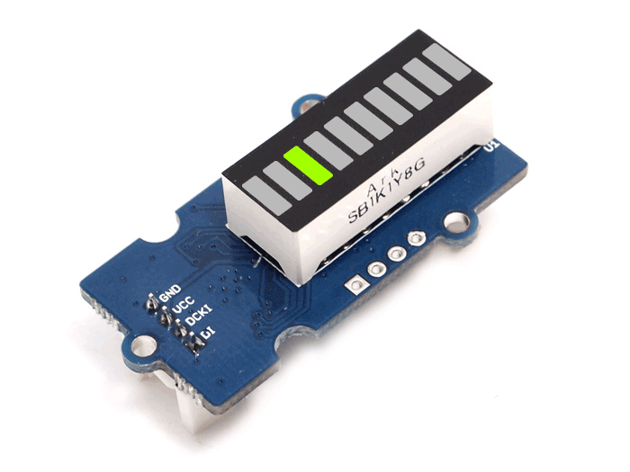
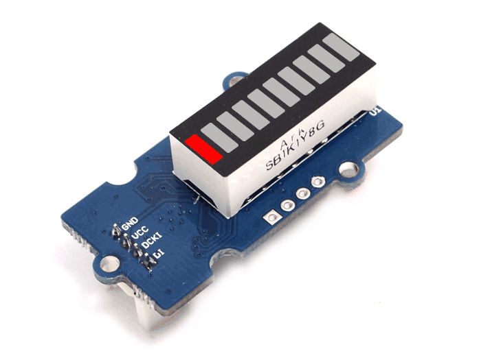

# Examples

## BasicControl 

----

## Bounce

----

## ControlSingleLed

----

## Level

----

## Random

----

## Reverse

----

## Toggle

----

## Walk

----

## WalkMultiple
Same as the Walk example, only with two Grove LED bars, the second initialised in reverse mode.
